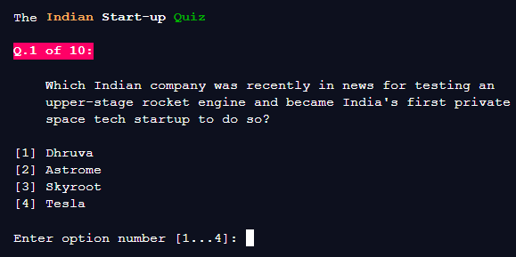

### CLI based Quiz on Indian Start-ups! Made with JavaScript.

This is a quiz game called "The Indian Start-up Quiz".   
   
It is developed in JavaScript at repl.it in Node.js environment.

#### Environment details:
- node v12.16.1
- chalk v4.1.0
- readline-sync v1.4.10

#### Features 
- stylized with CHALK
- ability to check highscores
- interesting facts after each correct answers

#### Screenshot
[

I have composed the questions after doing a lot of research about    
Indian startups. The quiz is about interesting info, recent news about acquisition and much more.

